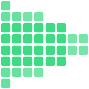

<p align="center"></p>

# glyphcast-core

**Video as text.** A typography-only video codec: every frame is a grid of
monospace cells, and each cell is one printable Unicode glyph (octant / sextant /
quadrant / halfblock / ascii-ramp block) plus two colors. No pixels are ever
stored or sent - only glyph indices and colors. It renders in a browser on the
GPU in a single draw call, and the exact same frame decodes in a terminal with
ANSI escapes.

This is the open codec core extracted from [glyphcast.tv](https://glyphcast.tv).
Zero runtime dependencies. Apache-2.0.

```
 ▄▖▜      ▌                 the wire never carries pixels -
 ▌ ▐ ▌▌▛▌▛▌▛▘▀▌▛▘▜▘         just glyph indices + colors,
 ▙▌▐▖▙▌▙▌▌▌▙▖█▌▄▌▐▖         decodable by anything that prints
```

## Why this is interesting

A terminal is a full receiver. The bar this codec holds itself to: what a
browser renders and what a terminal renders are the *same bytes*, and the wire
roundtrip is lossless - the receiver reconstructs the sender's cell state
bit-for-bit. `bun test` proves it across every mode and color depth:

```
$ bun test
  ✓ octant/color/888     120×34, 8 frames
  ✓ octant/mono/565      120×34, 8 frames
  ... 20 passed, 0 failed
```

## Quick start

```sh
bun install

bun run dev          # browser demo at localhost:5173 - drop a video, watch it
                     # become glyphs, see live wire bytes + the lossless check,
                     # and "copy frame as text" to paste the frame anywhere

bun run demo:term    # the same codec in your terminal, no browser, no server
bun test             # lossless wire-roundtrip assertion across all modes
```

The terminal demo and the browser demo share one encoder. The browser demo's
default source is a generated gradient (zero assets); drop any video file onto
the page to feed real frames.

## How it works

```
source frame  ──►  encodeCells  ──►  pack  ──►  [ wire bytes ]  ──►  unpack  ──►  render
 (ImageData)       glyph + 2 colors   delta vs                       receiver      GPU (1 draw)
                   per cell           prev frame                     state         or ANSI / terminal
```

- **`encodeCells`** (`src/encode.ts`) reduces each cell's subpixel block to one
  glyph index + a foreground and background color. It is a pure function over a
  structural `{ data, width, height }` - so it runs headless (Bun, Node, a
  worker), not just in a browser.
- **`pack` / `unpack`** (`src/wire.ts`) are the wire format: a frame is
  skip/emit runs against the previous frame, byte-aligned, no entropy coding
  (transport-level deflate handles that layer). Color is RGB565 (bandwidth tier)
  or RGB888 (fidelity tier). Dumb enough for an ESP32 to decode.
- **`createRendererGL`** (`src/renderer_gl.ts`) is one WebGL2 canvas, two data
  textures (fg + glyph index in alpha; bg) and a glyph atlas, drawn in a single
  `drawArrays` call - so a frame is atomic and tearing is impossible.
- **`renderAnsi`** (`clients/ansi.ts`) is the terminal renderer: the same
  receiver state, printed as ANSI truecolor.

## Glyph modes

| Mode | Subpixels / cell | Notes |
|---|---|---|
| `octant` | 2×4 | sharpest; rides its own 256-glyph Unicode page (U+1CD00 block) |
| `sextant` | 2×3 | Legacy Computing block |
| `quadrant` | 2×2 | the classic block-element look |
| `halfblock` | 1×2 | fg = top, bg = bottom |
| `ascii` | 1×1 | luma ramp, no color background |

## Public API

```ts
import { encodeCells, frameToPlainText, sampleX, sampleY, type Mode } from 'glyphcast-core/src/encode'
import { pack, unpack, createWireState, stateToCells, stateChecksum } from 'glyphcast-core/src/wire'
import { createRendererGL } from 'glyphcast-core/src/renderer_gl'
import { renderAnsi } from 'glyphcast-core/clients/ansi'
```

`src/demo.ts` is the smallest real example of wiring them together end to end.

## Honest scope

This is a different medium, not a better codec. H.264/AV1 win photographic
fidelity-per-bit by orders of magnitude, forever. Two things to be precise
about:

- The pixels-to-cells **encode is lossy** (each cell is a 2-color approximation
  of its block). The **wire format is lossless** with respect to those encoded
  cells - that is what the demo's "lossless" check and `bun test` verify.
- Bandwidth scales with cell count: a few hundred columns is hundreds of kbps
  (mono) to a few Mbps (color); pushing toward a 4K-class glyph lattice is a
  LAN-tier bitrate. The point isn't tiny files - it's that the reconstruction
  alphabet is printable characters, so anything that can print can be a screen.

`glyphcast-core` is the codec. The live streaming product on top of it -
named stations you tune into like a TV channel, the relay, audio, display FX -
lives at **[glyphcast.tv](https://glyphcast.tv)**. `clients/term.ts` is a live
receiver that speaks the wire format over WebSocket; point it at any relay, or
build your own (it's a one-caster / N-viewer broadcast).

## License

Apache-2.0. See [LICENSE](LICENSE) and [NOTICE](NOTICE).

Built by Orel Ohayon (Orellius) — [glyphcast.tv](https://glyphcast.tv) <!-- allow-personal: author-requested public attribution -->
